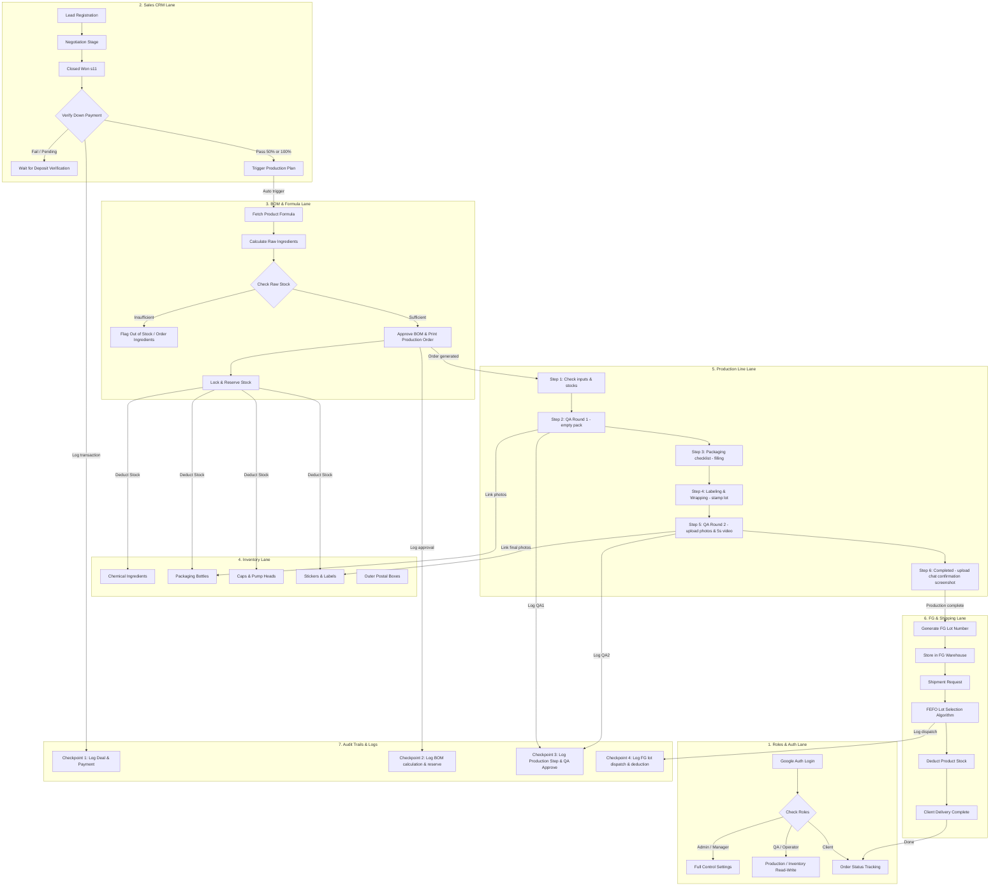

# Naive Ops — Unified ERP: System Design Document (system.md)

ระบบ **Naive Ops** เป็นการปฏิรูประบบการทำงานของ Naive Innova โดยรวม 5 ระบบเดิมที่แยกกันอยู่เข้าเป็นหนึ่งเดียว เพื่อให้ครอบคลุมและควบคุมเส้นทางการไหลของวัตถุดิบและข้อมูลทั้งหมด (Material & Sales Flow) แบบต้นน้ำยันปลายน้ำ

---

## 1. ภาพรวมการไหลของระบบ (Swimlane Architecture & Workflow Diagram)

ระบบ Naive Ops จัดสรรการดำเนินงานแยกตามบทบาทแผนกผ่านสถาปัตยกรรมแถวเลนกิจกรรม (Swimlane Flow) ประสานงานข้อมูลและจุดควบคุมความปลอดภัยโดยสมบูรณ์ ดังแผนภาพจำลองระบบหลัก:



### รายละเอียดการทำงานรายแผนก (Swimlane Flow Processing Details)

1. **1. Roles & Auth Swimlane (ระบบยืนยันตัวตนและคุมสิทธิ์)**:
   - ผู้ใช้งานทุกคนต้องผ่าน Google OAuth เพื่อระบุตัวตนและจับคู่สิทธิ์การทำงาน
   - **Admin/Manager**: เข้าถึงข้อมูลสต็อก ยอดเงิน ดีลขาย และการอนุมัติสูตร BOM ได้ทั้งหมด
   - **QA/Operator**: ดำเนินการและตรวจเช็คขั้นตอนในไลน์ผลิตและตรวจสอบสต็อกคลังวัสดุ
   - **Client**: ติดตามความคืบหน้าของล็อตสินค้าผ่านหน้าจอ Dashboard เฉพาะตัว

2. **2. Sales CRM Swimlane (ระบบงานขายและการรับเงิน)**:
   - ดีลงานของคลินิกคู่ค้าดำเนินตามท่อส่งงาน CRM (11 สถานะ)
   - เมื่อระบบตรวจพบค่านำเข้าว่าดีลอยู่ที่สถานะ "ปิดการขาย (s11)" และระบบตรวจสอบเงินมัดจำ (Down Payment) ได้รับครบถ้วน 50% หรือ 100% ระบบจะส่งคำสั่งสร้างคิววางแผนผลิตโดยอัตโนมัติ (Trigger Production Plan)

3. **3. BOM & Formula Swimlane (ระบบคำนวณและอนุมัติสูตรวัตถุดิบ)**:
   - หลังบ้านจะดึงสูตรวัตถุดิบและอัตราส่วนผสมของตัว SKU สินค้าที่สั่งมาคำนวณหักปริมาณคลังสารเคมีดิบ
   - หากยอดวัตถุดิบสารเคมีผ่านเกณฑ์ความพร้อม ระบบจะล็อก/จองสต็อกดิบเพื่อความปลอดภัย และอนุญาตให้ออกใบสั่งผลิต (BOM Formula Recipe Sheet) พร้อมเปิดสเต็ปในไลน์ผลิต

4. **4. Inventory Swimlane (คลังสินค้าและระบบหักยอดบรรจุภัณฑ์)**:
   - ระบบควบคุมยอดสต็อกแบบ Real-time แยกคลังระหว่าง: *สารเคมีผสม (Ingredients), ขวดบรรจุภัณฑ์ (Bottles), ฝาขวด/หัวปั๊ม (Caps/Pumps), ฉลากสินค้า (Stickers), และกล่องไปรษณีย์ (Postal Boxes)*
   - สต็อกจะถูกหักจองตั้งแต่ขั้นตอนคำนวณ BOM และถูกตัดสต็อกจริงหลังยืนยันการบรรจุผลิตในไลน์ผลิตเสร็จสิ้น

5. **5. Production Line Swimlane (ขั้นตอนสายผลิต 6-Step Wizard)**:
   - ไลน์ผลิตดำเนินงานตามตัวช่วยสร้าง 6 ขั้นตอน (Wizard Steps):
     - **Step 1**: ยืนยันวัตถุดิบ (ตรวจเช็คปริมาณลิตรของสารเคมีและระดับสต็อก ขวด, ฝา, สติกเกอร์)
     - **Step 2**: ตรวจสอบคุณภาพรอบที่ 1 (อัปโหลดรูปภาพขวดเปล่า, หัวปั๊ม และคลิปวิดีโอประกอบความยาว > 5 วินาที)
     - **Step 3**: ดำเนินการบรรจุผลิตภัณฑ์ (เช็กลิสต์ความเรียบร้อยการเตรียมขวด สติกเกอร์ สารเคมี และการบรรจุลงผลิตภัณฑ์)
     - **Step 4**: ติดฉลาก & ห่อหุ้ม (เช็กลิสต์การติดฉลากสติกเกอร์ ยิงล็อตวันที่ ซีลปากถุงพลาสติกอบความร้อน)
     - **Step 5**: ตรวจสอบคุณภาพรอบที่ 2 (อัปโหลดรูปถ่ายสินค้าสำเร็จรูป สติกเกอร์ ผลิตภัณฑ์เต็มตัว และคลิปหลักฐานความยาวไม่เกิน 5 วินาที)
     - **Step 6**: เสร็จสิ้นขั้นตอนผลิต (รอลูกค้ายืนยันและจัดส่ง โดยจัดแสดงหลักฐานรูปภาพหน้าจอแชทคอนเฟิร์ม)

6. **6. FG & Shipping Swimlane (คลังสินค้าสำเร็จรูปและการจัดส่ง FEFO)**:
   - สินค้าที่ผลิตเสร็จสิ้นจะเข้าสู่ระบบคลัง FG และออกรหัสล็อตผลิตอ้างอิงจากวันเสร็จสิ้นงาน
   - เมื่อมีธุรกรรมส่งมอบออกให้ลูกค้า ระบบจะรันคำนวณ **FEFO (First-Expired, First-Out)** เพื่อหยิบล็อตที่ใกล้หมดอายุก่อนมาทำการตัดจ่ายคลังสินค้า และส่งมอบสินค้าอย่างเป็นทางการ

7. **7. Audit Trails & Logs (จุดตรวจประวัติและควบคุมความปลอดภัย)**:
   - **Checkpoint 1 (CRM)**: บันทึกข้อมูลใบเสร็จรับเงิน การปิดขาย และเวลาที่ดีลเปลี่ยนเป็นใบงานผลิต
   - **Checkpoint 2 (BOM)**: บันทึกประวัติการคำนวณ การเบิกจ่ายจอง และชื่อผู้อนุมัติสูตรเคมี
   - **Checkpoint 3 (Production & QA)**: บันทึกประวัติการติ๊กเช็กลิสต์ผลผลิต วันเวลาตรวจ และรูปถ่าย QA ทั้งหมด
   - **Checkpoint 4 (FG & Sales Delivery)**: บันทึกประวัติการตัดล็อตสินค้าสำเร็จรูปด้วยหลัก FEFO และเวลาส่งมอบปลายทาง

## 1.2 กฎทางธุรกิจและกระบวนการทำงานทางเลือก (Business Logic Options & Edge Cases)

เนื่องจากระบบ MVP จริงต้องทำงานร่วมกับ API และฐานข้อมูลถาวร กฎการไหลของข้อมูลและสิทธิ์จึงมีสองทางเลือกหลักซึ่งระบุสเปกไว้ดังนี้:

### A. การเชื่อมต่อระหว่าง CRM กับบอร์ดสั่งผลิต (Sales to Production Trigger)
* **ทางเลือกที่ 1 (อัตโนมัติ):** เมื่อผู้ใช้เปลี่ยนสถานะ Lead เป็น "ปิดการขาย (s11)" ในโมดูลเซลล์ และมีการชำระเงินมัดจำ ระบบจะทำรายการสร้างตารางวางแผนผลิต (Production Queue) ในหลังบ้านโดยอัตโนมัติ
* **ทางเลือกที่ 2 (แมนนวล):** ดีลที่ปิดการขายสำเร็จจะถูกแสดงผลในตารางพักคิวสั่งผลิต และหัวหน้าแผนกผลิตจะต้องมาตรวจสอบความพร้อมและกดยืนยันคำสั่งลงบอร์ดคำนวณ BOM ด้วยตัวเอง

### B. สิทธิ์การมองเห็นข้อมูลตามบทบาท (Row Isolation & RBAC Matrix)
ระบบต้องบังคับใช้การคุมสิทธิ์ข้ามบทบาท (Role-based Row Isolation) ดังนี้:
1. **Sales (ฝ่ายขาย):**
   - มองเห็นเฉพาะ Lead ลูกค้าที่ตนเองได้รับมอบหมาย (`assignee`) หรือที่ตนสร้างขึ้นเท่านั้น
   - ไม่มีสิทธิ์เข้าถึงหน้าจอแก้ไขสูตร BOM หรือคลังวัตถุดิบสารเคมีหลัก
2. **Operator (ฝ่ายผลิต/คลังวัตถุดิบ):**
   - มองเห็นและคีย์ประวัติรับ-เบิกสารเคมีและบรรจุภัณฑ์ได้
   - ไม่มีสิทธิ์ดูยอดเงินมัดจำหรือดีลการขายในหน้าเซลล์
3. **Manager / Admin (ผู้จัดการ):**
   - มองเห็นและแก้ไขข้อมูลได้ทุกแถวแบบข้ามผู้ใช้ (Bypass Row Isolation)

### C. ตรรกะการหักสต็อกบรรจุภัณฑ์ (Packaging Deduction Triggers)
* **ระบบตัดยอดสต็อกอัตโนมัติเมื่อเริ่มผลิต (Auto Deduction on Production Start):**
  - เมื่อกระบวนการผลิตผ่านขั้นตอนตรวจรับประกันคุณภาพรอบแรก (QA รอบที่ 1) ในสเต็ปที่ 2 เรียบร้อยแล้ว สถานะผลิตจะเข้าสู่สถานะ **"รอยืนยัน"** (รอยืนยันผลิต)
  - เมื่อผู้ใช้กดปุ่ม **"ยืนยันเริ่มผลิต & ตัดสต็อกคลังบรรจุภัณฑ์"** ในสเต็ปที่ 3 บรรจุภัณฑ์ สถานะตัวใบสั่งผลิตในระบบจะเปลี่ยนผ่านเป็น **"กำลังผลิต"** ทันที
  - ณ จังหวะกดยืนยันนี้ ระบบ API จะดึงรายการคลังวัสดุประกอบจริงในฐานข้อมูล ได้แก่ *ขวดบรรจุภัณฑ์ (Bottle)*, *ฝาขวด/หัวกดปั๊ม (Cap/Pump)*, และ *สติกเกอร์ฉลากสินค้า (Sticker/Label)* ที่ถูกจับคู่กับสินค้านั้นๆ มาหักสต็อกยอดจำนวนจริงที่สั่งลบออกจากสต็อกปัจจุบัน (`currentQuantity`)
  - เพื่อความปลอดภัยและความแม่นยำ ระบบมีตัวควบคุมสถานะ `isStockDeducted: true` บันทึกควบคู่ในคอลเลกชันเพื่อป้องกันการดึงสคริปต์ตัดสต็อกซ้ำซ้อนอย่างเด็ดขาด

### D. ตรรกะการตัดลอตหมดอายุแบบ FEFO (Finished Goods Slicing Algorithm)
* ระบบจะทำการสแกนประวัติลอต (`FG_LOT`) ที่สอดคล้องกับตัวสินค้าสำเร็จรูป
* ทำการเรียงลำดับลอตที่ `expDate` น้อยที่สุดขึ้นก่อน (หมดอายุก่อน)
* หากจำนวนสินค้าที่ต้องเบิกจ่ายมากกว่าสินค้าที่มีอยู่ในลอตแรก ระบบจะตัดยอดลอตแรกจนเหลือ 0 ชิ้น และนำจำนวนที่เหลือไปตัดจากลอตถัดไปแบบอัตโนมัติ (Sequential Slicing) จนกว่าจะครบจำนวน

---

เพื่อรองรับการขยายตัวและการเปลี่ยนผ่านจาก In-memory Single-file HTML ไปเป็นเว็บแอปพลิเคชันระดับองค์กรที่เสถียรและยืดหยุ่นสูง เราเลือกใช้โครงสร้างสถาปัตยกรรมดังนี้:

### สแต็กเทคโนโลยี (Tech Stack)
* **Frontend (หน้าบ้าน)**:
  * **Next.js (App Router)**: สำหรับจัดทำโครงสร้างเส้นทางหน้าเว็บ (Routing), Server-Side Rendering (SSR) ในส่วนที่ต้องการความเร็ว และ Client-Side components สำหรับหน้าจอโต้ตอบความเร็วสูง
  * **Hero UI Framework**: ชุดคอมโพเนนต์สำเร็จรูปที่มีความสวยงามระดับพรีเมียม (Premium Aesthetics) รองรับ Dark/Light Mode และการตอบสนองที่ลื่นไหล
  * **Tailwind CSS v4**: ควบคุมดีไซน์เน้นการใช้คลาสอรรถประโยชน์ (Utility-First) และแอนิเมชันขนาดเล็ก (Micro-animations)
* **Backend (หลังบ้าน)**:
  * **Express.js (Node.js)**: สำหรับเป็น RESTful API Server จัดการ Business Logic, คำนวณสต็อกวัตถุดิบ/บรรจุภัณฑ์, ประมวลผลการคำนวณ BOM, และเป็น OAuth callback handler
  * **Google OAuth (Passport.js / Next-Auth)**: บริหารจัดการการเข้าสู่ระบบอย่างปลอดภัยผ่านบัญชี Google โดยกำหนดให้ **หน้าจอแรก (Landing Page) ของระบบต้องเป็นหน้า Login ผ่าน Google OAuth** และระบบจะทำการตรวจเช็คสถานะการเข้าสู่ระบบเสมอ หากพบคำขอที่ไม่มีสิทธิ์เข้าถึง (Unauthenticated) จะทำการดักหน้าและเปลี่ยนเส้นทาง (Redirect) กลับมายังหน้า Login โดยอัตโนมัติ
* **Database (ระบบฐานข้อมูล)**:
  * **MongoDB (Mongoose)**: จัดเก็บข้อมูลรูปแบบ Document ไร้โครงสร้างที่ยืดหยุ่นสูง (Schemaless) เหมาะกับการเก็บประวัติ Transaction, ข้อมูลสินค้าสำเร็จรูปที่มีหลายแอตทริบิวต์ และข้อมูล CRM ของลูกค้า

### การแยกข้อมูลระดับแถว (Row Isolation & Multitenancy)
ระบบจะทำการแยกสิทธิ์การมองเห็นข้อมูลตามระดับผู้ใช้หรือแผนก (Row Isolation) โดยใช้หลักการดังนี้:
- เพิ่มฟิลด์ `userId` หรือ `tenantId` ในทุก ๆ Document ในฐานข้อมูล
- ใช้ **Mongoose Query Middleware** (เช่น `pre('find')`, `pre('findOne')`) ในการกรองข้อมูลแบบอัตโนมัติ (Query Hook Filtering) เพื่อระบุเฉพาะแถวที่ผู้ใช้ที่เข้าสู่ระบบมีสิทธิ์เข้าถึงเท่านั้น

### ระบบส่งออกข้อมูล (Excel & CSV Export Engine)
- **CSV Engine**: ใช้ `fast-csv` หรือ `json2csv` ในการแปลงข้อมูล JSON เป็น CSV เพื่อการประมวลผลที่รวดเร็ว
- **Excel Engine (Goal of Excel)**: ใช้ `exceljs` หรือ `xlsx (SheetJS)` สำหรับแปลงหน้าตารางสรุปสต็อกและประวัติให้กลายเป็นไฟล์ Excel (.xlsx) ที่มีการจัดแต่งสีสันและรูปแบบชีตตามธีมการออกแบบของ Naive Ops

### แนวทางการออกแบบ UI/UX (UI/UX Design System Rules)
1. **Premium Dark Theme**: ควบคุมการใช้งานธีมหลักด้วย Production OS theme (พื้นหลังมืดสนิทไล่ระดับ, หน้าการ์ดสีเทาเข้มแบบโปร่งแสง/Glassmorphism)
2. **Dynamic UI & Micro-animations**:
   - เพิ่ม Hover effects บนปุ่มและลิงก์ทั้งหมด
   - ใช้ Transition หน่วงเวลาสั้น ๆ (เช่น `transition-all duration-200`) เมื่อเปิด Modal/Drawer หรือย้ายการ์ด Kanban
3. **Data Scannability & Visual Hierarchy**:
   - ตัวเลขจำนวนเงินหรือน้ำหนักวัตถุดิบเด่นชัด ใช้ Mono-spaced Font เพื่อความสม่ำเสมอในตาราง
   - แท็กและ Badge สถานะ (เช่น ⚠️ ใกล้หมด, ❌ ขาด) ใช้สีพาสเทลบนพื้นหลังโปร่งแสง

---

## 3. โครงสร้างฐานข้อมูล (Database Schemas)

การออกแบบ Model หลักใน MongoDB (ผ่าน Mongoose) เพื่อเชื่อมต่อข้อมูลแต่ละส่วนและรองรับ Row Isolation กับ OAuth:

### A. User / Auth Model
```typescript
const UserSchema = new mongoose.Schema({
  googleId: { type: String, required: true, unique: true },
  email: { type: String, required: true, unique: true },
  name: { type: String, required: true },
  avatarUrl: { type: String },
  role: { type: String, enum: ['Admin', 'Manager', 'QA', 'Operator'], default: 'Operator' }
}, { timestamps: true });
```

### B. Sales / Lead Model (พร้อม Row Isolation)
```typescript
const SalesLeadSchema = new mongoose.Schema({
  ownerId: { type: mongoose.Schema.Types.ObjectId, ref: 'User', required: true }, // Row Isolation field
  name: { type: String, required: true },
  section: { type: String, enum: ['s1', 's2', 's3', 's4', 's5', 's6', 's7', 's8', 's9', 's10', 's11'], default: 's1' },
  source: { type: String, default: 'Google Map' },
  province: { type: String },
  provinceStrike: { type: Boolean, default: false },
  phone: { type: String },
  assignee: { type: String },
  assigneeColor: { type: String },
  dueDate: { type: String },
  nextCallDate: { type: String },
  note: { type: String },
  contactPerson: { type: String },
  estValue: { type: Number, default: 0 },
  payPct: { type: String, enum: ['50', '100', ''] },
  paidAmount: { type: Number, default: 0 }
}, { timestamps: true });
```

### C. Ingredient & BOM Model (พร้อม Row Isolation)
```typescript
const IngredientSchema = new mongoose.Schema({
  ownerId: { type: mongoose.Schema.Types.ObjectId, ref: 'User', required: true }, // Row Isolation field
  name: { type: String, required: true, unique: true },
  openingStock: { type: Number, required: true, default: 0 }, // กรัม
  supplier: { type: String },
  pricePerKg: { type: Number, default: 0 }
});

const BomFormulaSchema = new mongoose.Schema({
  ownerId: { type: mongoose.Schema.Types.ObjectId, ref: 'User', required: true }, // Row Isolation field
  name: { type: String, required: true, unique: true },
  color: { type: String, default: '#2E7D32' },
  bom: { type: Map, of: Number } // Key: ชื่อวัตถุดิบ, Value: กรัมต่อ 1 กก.สูตร
});
```

### D. Packaging & Postal Box Model (พร้อม Row Isolation)
```typescript
const PackagingItemSchema = new mongoose.Schema({
  ownerId: { type: mongoose.Schema.Types.ObjectId, ref: 'User', required: true }, // Row Isolation field
  name: { type: String, required: true },
  type: { type: String, enum: ['บรรจุภัณฑ์', 'สินค้าพร้อมส่ง', 'กล่อง&ซอง', 'อื่นๆ'] },
  customer: { type: String, required: true }, // "ระบบ" หรือ ชื่อลูกค้าเฉพาะราย
  initialQuantity: { type: Number, default: 0 },
  currentQuantity: { type: Number, default: 0 },
  image: { type: String }, // Base64 หรือ URL รูปภาพ
  note: { type: String }
});
```

### E. Finished Goods (FG) & Lot Model (พร้อม Row Isolation)
```typescript
const ProductSkuSchema = new mongoose.Schema({
  ownerId: { type: mongoose.Schema.Types.ObjectId, ref: 'User', required: true }, // Row Isolation field
  id: { type: String, required: true, unique: true }, // เช่น SH-BIO-120ML-DM-OEM
  name: { type: String, required: true },
  brand: { type: String },
  category: { type: String },
  minStock: { type: Number, default: 0 },
  unit: { type: String, default: 'ชิ้น' }
});

const ProductLotSchema = new mongoose.Schema({
  ownerId: { type: mongoose.Schema.Types.ObjectId, ref: 'User', required: true }, // Row Isolation field
  productId: { type: String, required: true },
  lotNo: { type: String, required: true },
  mfgDate: { type: Date, required: true },
  expDate: { type: Date, required: true },
  quantity: { type: Number, required: true, default: 0 },
  customer: { type: String }
});
```

---

## 3.1 โครงสร้างสายการผลิตและขั้นตอนผลิต (Production Line & 6-Step Wizard)

เพื่อความสมบูรณ์ในการย้ายการผลิตลงสู่ฐานข้อมูล MongoDB ระบบมีการเก็บสถานะและหลักฐานรูปภาพจริงโดยแชร์โมเดลกับบัญชีลูกค้า (User Model) ดังนี้:

### A. ข้อมูลสถานะและไฟล์แนบของการผลิต (Production Fields in User Model)
* `productionStatus`: สถานะขั้นตอนผลิตปัจจุบัน (เช่น `ยังไม่ผลิต`, `รอยืนยัน`, `กำลังผลิต (บรรจุ)`, `กำลังผลิต (ติดฉลาก)`, `รอตรวจ QA รอบที่ 2`, `รอลูกค้ายืนยัน`, `ลูกค้ายืนยันแล้ว`, `สำเร็จเสร็จสิ้น`)
* `productionStep`: หมายเลขขั้นตอนปัจจุบัน (สเต็ป 1 ถึง 6)
* `qa1BulkPhoto` / `qa1EmptyPackPhoto` / `qa1PackagingPhoto` / `qa1PumpPhoto` / `qa1StickerPhoto` / `qa1AssembledVideo`: รูปภาพและวิดีโอหลักฐานการตรวจ QA รอบที่ 1
* `qaPackagingPhoto` / `qaPumpPhoto` / `qaStickerPhoto` / `qaAssembledVideo`: รูปภาพและวิดีโอหลักฐานการตรวจ QA รอบที่ 2 (ความยาวไม่เกิน 5 วินาที)
* `chatScreenshotProof`: รูปภาพหลักฐานการแชทคอนเฟิร์มรับสินค้าจากลูกค้า (จัดเก็บเป็น Base64 ใน MongoDB)
* `qaStatus`: สถานะการตรวจ (`pending`, `approved`, `rejected`)

### B. จุดเชื่อมต่อข้อมูลสายการผลิต (Production API Endpoints)
* `GET /api/production/orders`: ดึงรายการใบสั่งผลิตทั้งหมด แยกตามสิทธิ์บทบาท (Row Isolation)
* `GET /api/production/orders/:id`: ดึงรายละเอียดใบสั่งผลิตรายบุคคล
* `PUT /api/production/orders/:id/status`: อัปเดตสถานะการผลิต แนบรูปแชทยืนยันจากลูกค้าลงฐานข้อมูลโดยตรง
* `PUT /api/production/orders/:id/step`: อัปเดตเช็กลิสต์การตรวจ ขั้นตอนสเต็ปการผลิต และข้อมูล Base64 ของไฟล์รูปถ่าย/คลิปวิดีโอในแต่ละขั้นตอน

---

## 4. แผนงานการพัฒนาสู่ระบบจริง (Implementation MVP Plan)

การพัฒนา Naive Ops ได้ดำเนินงานคืบหน้าตามแผนงานของระบบจริงดังนี้:

* **[x] เฟส 1: โครงสร้างและการจัดเตรียมระบบหลังบ้าน (Backend Setup, DB Seed & Auth)**
  - [x] ติดตั้งโปรเจกต์ Next.js, Express Server และทำการเชื่อมต่อ MongoDB
  - [x] พัฒนาระบบ Auth และเชื่อมโยงผู้ใช้กับ API
  - [x] ออกแบบโครงสร้าง Mongoose Models ครอบคลุมผู้ใช้, สูตร BOM, คลังสินค้า และบรรจุภัณฑ์
* **[x] เฟส 2: การพัฒนาส่วนหน้าจอแสดงผลและคอมโพเนนต์ (Frontend Development & UI/UX)**
  - [x] ประกอบโมดูลหลักเป็นคอมโพเนนต์ย่อยใน Next.js (Sales CRM, BOM, คลังสินค้า)
  - [x] ออกแบบและปรับปรุงธีมสีแบรนด์เขียว/เทาเข้ม (Premium Green-Themed UI) ของระบบอย่างสวยงาม
  - [x] ปรับรูปแบบหน้าจอยืนยันวัตถุดิบและรายการตรวจสอบ (Checklist 6 ขั้นตอน) ให้ลื่นไหล ตอบโจทย์การใช้งานจริง
* **[x] เฟส 3: เชื่อมต่อหลังบ้านสายการผลิตและฐานข้อมูล (Production API & MongoDB Integration)**
  - [x] เปลี่ยนผ่านระบบพักจำลอง `localStorage` สู่การเชื่อมต่อ API จริงผ่าน Axios ไปยังฐานข้อมูล MongoDB
  - [x] พัฒนา API รับส่งรหัสโค้ดรูปภาพ/วิดีโอ (Base64) เซฟบันทึกจริงลงคอลเลกชัน MongoDB
  - [x] แยกคอลัมน์ขั้นตอนที่ 1 เป็น 2 ฝั่ง (ฝั่งซ้าย: สูตร/ปริมาณลิตรเคมี, ฝั่งขวา: สถานะเช็คสต็อกบรรจุภัณฑ์) เพื่อให้อ่านและตรวจสอบความพร้อมในสายผลิตง่ายที่สุด
  - [x] แบ่งเช็กลิสต์ย่อยขั้นตอนบรรจุหีบห่อเป็นขั้นตอนที่ 3 (บรรจุภัณฑ์) และขั้นตอนที่ 4 (ติดฉลาก & ห่อหุ้ม) แบบแนวนอน 4 ช่องแถวเดียว (Aspect Ratio 1:1) ชิดซ้าย พร้อมไอคอนสัญลักษณ์เข้าใจง่าย
  - [x] จำกัดความยาวคลิปหลักฐานสเต็ป 5 (QA รอบที่ 2) ไม่เกิน 5 วินาที
  - [x] ออกแบบหน้าจอนำเข้าภาพหลักฐานแชทยืนยันของลูกค้าเพื่ออนุมัติปิดล็อตในสเต็ปที่ 6
* **[/] เฟส 4: ระบบการเบิกล็อตสินค้าสำเร็จรูปและ Export Engine**
  - [x] เขียนโมดูลสรุปสถิติจำนวนรวมการผลิตและชาร์ตรายงานผลหน้า Dashboard
  - [ ] พัฒนาระบบเบิกจ่ายสินค้าสำเร็จรูป Lotting FEFO
  - [ ] จัดทำระบบส่งออกรายงานประวัติและสต็อก Excel (.xlsx) และ CSV
