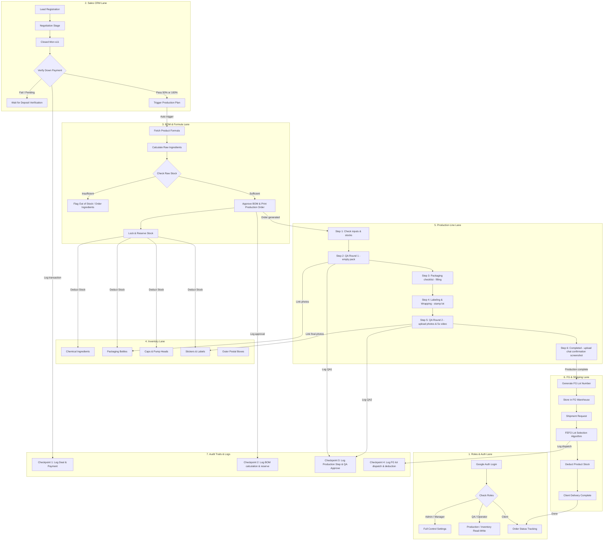

# Naive Ops — Unified ERP: System Design Document (system.md)

**Naive Ops** is an overhaul of Naive Innova's operations that consolidates 5 previously separate systems into a single unified platform, providing comprehensive coverage and control over the entire Material & Sales Flow from upstream to downstream.

---

## 1. System Flow Overview (Swimlane Architecture & Workflow Diagram)

Naive Ops organizes operations by department role through Swimlane Flow architecture, coordinating data and safety control points completely, as illustrated in the main system diagram:



### Swimlane Flow Processing Details

1. **1. Roles & Auth Swimlane (Authentication & Authorization)**:
   - All users must authenticate via Google OAuth to verify identity and match working permissions.
   - **Admin/Manager**: Full access to stock data, balances, sales deals, and BOM formula approvals.
   - **QA/Operator**: Execute and verify steps on the production line and audit the raw material warehouse stock.
   - **Client**: Tracks the progress of their product lot through a dedicated Dashboard screen.

2. **2. Sales CRM Swimlane (Sales & Payment)**:
   - Partner clinic deals follow a CRM pipeline (11 stages).
   - When the imported value indicates the deal is at "Closed Won (s11)" and the Down Payment verification has been fully received (50% or 100%), the system automatically triggers the Production Plan queue creation.

3. **3. BOM & Formula Swimlane (Ingredient Calculation & Approval)**:
   - The backend fetches the raw material formula and mixture ratios for the ordered SKU to calculate deductions against raw chemical stock.
   - If raw chemical ingredient levels pass the readiness threshold, the system locks/reserves the raw stock for safety and issues the BOM Formula Recipe Sheet, while enabling the steps on the production line.

4. **4. Inventory Swimlane (Warehouse & Packaging Deduction)**:
   - The system manages Real-time stock levels, separated by warehouse type: *Ingredients, Bottles, Caps/Pumps, Stickers, and Postal Boxes*.
   - Stock is reserved from the BOM calculation stage and physically deducted once packaging and production on the line are confirmed complete.

5. **5. Production Line Swimlane (6-Step Wizard)**:
   - The production line runs according to a 6-step wizard:
     - **Step 1**: Confirm raw materials (check chemical volume in liters and stock level of bottles, caps, stickers).
     - **Step 2**: Quality check round 1 (upload photos of empty bottles, pump heads, and supporting video clips longer than 5 seconds).
     - **Step 3**: Carry out product filling (checklist for readiness of bottles, stickers, chemicals, and product filling).
     - **Step 4**: Labeling & Wrapping (checklist for sticker labeling, stamping lot date, heat-sealing plastic bag opening).
     - **Step 5**: Quality check round 2 (upload photos of finished products, stickers, full product, and evidence clips no longer than 5 seconds).
     - **Step 6**: Production complete (wait for customer confirmation and dispatch, displaying chat confirmation screenshot evidence).

6. **6. FG & Shipping Swimlane (Finished Goods Warehouse & FEFO Dispatch)**:
   - Finished products enter the FG warehouse system and receive a production lot number referencing the completion date.
   - When a dispatch transaction is released to the customer, the system runs the **FEFO (First-Expired, First-Out)** calculation to pick the lot nearest to expiry first for warehouse deduction, and formally delivers the goods.

7. **7. Audit Trails & Logs (History Checkpoints & Security Control)**:
   - **Checkpoint 1 (CRM)**: Records receipts, sales closing, and the time a deal becomes a production work order.
   - **Checkpoint 2 (BOM)**: Records calculation history, reservation withdrawal, and the name of the chemical formula approver.
   - **Checkpoint 3 (Production & QA)**: Records production checklist history, inspection date/time, and all QA photos.
   - **Checkpoint 4 (FG & Sales Delivery)**: Records FG lot deduction under FEFO and end-destination delivery times.

## 1.2 Business Logic Options & Edge Cases

Since the real MVP system must work with an API and a persistent database, data flow and permission rules have two main options specified as follows:

### A. Sales to Production Trigger
* **Option 1 (Automatic):** When a user changes a Lead's status to "Closed Won (s11)" in the Sales module and a deposit payment is made, the system automatically creates a Production Queue record in the backend.
* **Option 2 (Manual):** Successfully closed deals are displayed in a pending production queue table, and the production supervisor must inspect readiness and press confirm to push the order onto the BOM calculation board themselves.

### B. Row Isolation & RBAC Matrix
The system must enforce cross-role permission control (Role-based Row Isolation) as follows:
1. **Sales:**
   - Can only see customer Leads assigned to them (`assignee`) or those they created.
   - No access to the BOM formula editing screen or primary raw chemical stock.
2. **Operator (Production/Ingredient Warehouse):**
   - Can view and record raw chemical receipt/withdrawal history and packaging.
   - Cannot view deposit amounts or sales deals in the Sales screen.
3. **Manager / Admin:**
   - Can view and edit all rows across users (Bypass Row Isolation).

### C. Packaging Deduction Triggers
* **Auto Deduction on Production Start:**
  - Once the production process passes the first quality assurance inspection (QA Round 1) in Step 2, the production status moves to **"Pending Confirmation"** (production pending).
  - When the user presses the **"Confirm Production Start & Deduct Packaging Stock"** button in Step 3 (packaging), the work order status in the system immediately transitions to **"In Production"**.
  - At the moment of confirmation, the system API fetches the actual packaging material stock items in the database, namely *Bottle*, *Cap/Pump*, and *Sticker/Label* associated with that product, and deducts the actual ordered quantity from the current stock (`currentQuantity`).
  - For safety and accuracy, the system has a state guard `isStockDeducted: true` recorded alongside in the collection to decisively prevent duplicate stock-deduction scripts from being executed.

### D. FEFO Finished Goods Slicing Algorithm
* The system scans the `FG_LOT` history relevant to the finished product.
* Orders lots by the smallest `expDate` first (those expiring soonest).
* If the required withdrawal quantity exceeds what is available in the first lot, the system deducts the first lot until 0 pieces remain and automatically carries the remainder to the next lot (Sequential Slicing) until the required quantity is met.

---

To support expansion and the transition from an In-memory Single-file HTML prototype to a stable, highly flexible enterprise web application, we have selected the following architectural structure:

### Tech Stack
* **Frontend**:
  * **Next.js (App Router)**: For page routing structure, Server-Side Rendering (SSR) where speed is needed, and Client-Side components for high-speed interactive screens.
  * **Hero UI Framework**: A ready-made component set with premium aesthetics, supporting Dark/Light Mode and smooth responsiveness.
  * **Tailwind CSS v4**: Design control emphasizing utility-first classes and micro-animations.
* **Backend**:
  * **Express.js (Node.js)**: As the RESTful API Server managing Business Logic, raw ingredient/packaging stock calculation, BOM computation, and acting as the OAuth callback handler.
  * **Google OAuth (Passport.js / Next-Auth)**: Manages secure login via Google accounts, requiring that **the system's Landing Page must be a Google OAuth Login screen**, and the system always checks the login status. If an unauthenticated request is detected, it intercepts the page and redirects back to the Login screen automatically.
* **Database**:
  * **MongoDB (Mongoose)**: Stores flexible, schemaless document data suitable for Transaction history, finished product data with multiple attributes, and customer CRM data.

### Row Isolation & Multitenancy
The system segregates data visibility by user/team level (Row Isolation) using the following principles:
- Add a `userId` or `tenantId` field to every Document in the database.
- Use **Mongoose Query Middleware** (e.g., `pre('find')`, `pre('findOne')`) to filter data automatically (Query Hook Filtering), returning only rows the logged-in user is permitted to access.

### Excel & CSV Export Engine
- **CSV Engine**: Use `fast-csv` or `json2csv` to convert JSON data to CSV for fast processing.
- **Excel Engine (Goal of Excel)**: Use `exceljs` or `xlsx (SheetJS)` to turn stock summary tables and history into Excel (.xlsx) files styled with colors and sheet formatting matching the Naive Ops design theme.

### UI/UX Design System Rules
1. **Premium Dark Theme**: Control the main theme using the Production OS theme (deep gradient dark background, dark gray translucent glassy cards / Glassmorphism).
2. **Dynamic UI & Micro-animations**:
   - Add Hover effects to all buttons and links.
   - Use short-delay transitions (e.g., `transition-all duration-200`) when opening Modals/Drawers or moving Kanban cards.
3. **Data Scannability & Visual Hierarchy**:
   - Amount numbers or raw material weights are emphasized, using mono-spaced Fonts for consistency in tables.
   - Status tags and badges (e.g., ⚠️ low stock, ❌ out of stock) use pastel colors on translucent backgrounds.

---

## 3. Database Schemas

The main MongoDB models (via Mongoose) design to connect each part and support Row Isolation with OAuth:

### A. User / Auth Model
```typescript
const UserSchema = new mongoose.Schema({
  googleId: { type: String, required: true, unique: true },
  email: { type: String, required: true, unique: true },
  name: { type: String, required: true },
  avatarUrl: { type: String },
  role: { type: String, enum: ['Admin', 'Manager', 'QA', 'Operator'], default: 'Operator' }
}, { timestamps: true });
```

### B. Sales / Lead Model (with Row Isolation)
```typescript
const SalesLeadSchema = new mongoose.Schema({
  ownerId: { type: mongoose.Schema.Types.ObjectId, ref: 'User', required: true }, // Row Isolation field
  name: { type: String, required: true },
  section: { type: String, enum: ['s1', 's2', 's3', 's4', 's5', 's6', 's7', 's8', 's9', 's10', 's11'], default: 's1' },
  source: { type: String, default: 'Google Map' },
  province: { type: String },
  provinceStrike: { type: Boolean, default: false },
  phone: { type: String },
  assignee: { type: String },
  assigneeColor: { type: String },
  dueDate: { type: String },
  nextCallDate: { type: String },
  note: { type: String },
  contactPerson: { type: String },
  estValue: { type: Number, default: 0 },
  payPct: { type: String, enum: ['50', '100', ''] },
  paidAmount: { type: Number, default: 0 }
}, { timestamps: true });
```

### C. Ingredient & BOM Model (with Row Isolation)
```typescript
const IngredientSchema = new mongoose.Schema({
  ownerId: { type: mongoose.Schema.Types.ObjectId, ref: 'User', required: true }, // Row Isolation field
  name: { type: String, required: true, unique: true },
  openingStock: { type: Number, required: true, default: 0 }, // grams
  supplier: { type: String },
  pricePerKg: { type: Number, default: 0 }
});

const BomFormulaSchema = new mongoose.Schema({
  ownerId: { type: mongoose.Schema.Types.ObjectId, ref: 'User', required: true }, // Row Isolation field
  name: { type: String, required: true, unique: true },
  color: { type: String, default: '#2E7D32' },
  bom: { type: Map, of: Number } // Key: ingredient name, Value: grams per 1 kg formula
});
```

### D. Packaging & Postal Box Model (with Row Isolation)
```typescript
const PackagingItemSchema = new mongoose.Schema({
  ownerId: { type: mongoose.Schema.Types.ObjectId, ref: 'User', required: true }, // Row Isolation field
  name: { type: String, required: true },
  type: { type: String, enum: ['Packaging', 'Ready to Ship', 'Boxes & Envelopes', 'Others'] },
  customer: { type: String, required: true }, // "System" or a specific customer name
  initialQuantity: { type: Number, default: 0 },
  currentQuantity: { type: Number, default: 0 },
  image: { type: String }, // Base64 or image URL
  note: { type: String }
});
```

### E. Finished Goods (FG) & Lot Model (with Row Isolation)
```typescript
const ProductSkuSchema = new mongoose.Schema({
  ownerId: { type: mongoose.Schema.Types.ObjectId, ref: 'User', required: true }, // Row Isolation field
  id: { type: String, required: true, unique: true }, // e.g., SH-BIO-120ML-DM-OEM
  name: { type: String, required: true },
  brand: { type: String },
  category: { type: String },
  minStock: { type: Number, default: 0 },
  unit: { type: String, default: 'piece' }
});

const ProductLotSchema = new mongoose.Schema({
  ownerId: { type: mongoose.Schema.Types.ObjectId, ref: 'User', required: true }, // Row Isolation field
  productId: { type: String, required: true },
  lotNo: { type: String, required: true },
  mfgDate: { type: Date, required: true },
  expDate: { type: Date, required: true },
  quantity: { type: Number, required: true, default: 0 },
  customer: { type: String }
});
```

---

## 3.1 Production Line & 6-Step Wizard

To fully migrate production to the MongoDB database, the system stores status and real image evidence sharing the model with customer accounts (User Model) as follows:

### A. Production Fields in User Model
* `productionStatus`: Current production step status (e.g., `Not yet produced`, `Pending confirmation`, `In production (filling)`, `In production (labeling)`, `Awaiting QA round 2`, `Awaiting customer confirmation`, `Customer confirmed`, `Completed`).
* `productionStep`: Current step number (step 1 to 6).
* `qa1BulkPhoto` / `qa1EmptyPackPhoto` / `qa1PackagingPhoto` / `qa1PumpPhoto` / `qa1StickerPhoto` / `qa1AssembledVideo`: QA round 1 photo and video evidence.
* `qaPackagingPhoto` / `qaPumpPhoto` / `qaStickerPhoto` / `qaAssembledVideo`: QA round 2 photo and video evidence (no longer than 5 seconds).
* `chatScreenshotProof`: Chat confirmation screenshot evidence from the customer (stored as Base64 in MongoDB).
* `qaStatus`: Inspection status (`pending`, `approved`, `rejected`).

### B. Production API Endpoints
* `GET /api/production/orders`: Fetch all production work orders, filtered by role permissions (Row Isolation).
* `GET /api/production/orders/:id`: Fetch a single production work order detail.
* `PUT /api/production/orders/:id/status`: Update production status, attaching customer chat confirmation screenshot directly to the database.
* `PUT /api/production/orders/:id/step`: Update inspection checklists, production step, and Base64 photo/video files in each step.

---

## 4. Implementation MVP Plan

Naive Ops development is progressing according to the real system plan as follows:

* **[x] Phase 1: Backend Setup, DB Seed & Auth**
  - [x] Set up the Next.js project, Express Server, and connect MongoDB.
  - [x] Develop the Auth system and link users to the API.
  - [x] Design Mongoose Models covering users, BOM formulas, warehousing, and packaging.
* **[x] Phase 2: Frontend Development & UI/UX**
  - [x] Assemble main modules into sub-components in Next.js (Sales CRM, BOM, Inventory).
  - [x] Design and refine the premium green/dark gray branded theme (Premium Green-Themed UI).
  - [x] Refine the raw material confirmation screen and the 6-step checklist to be smooth and practical for real use.
* **[x] Phase 3: Production API & MongoDB Integration**
  - [x] Transition from the in-memory `localStorage` mock to real API integration via Axios to MongoDB.
  - [x] Develop APIs to send/receive Base64 image/video codes and save them to MongoDB collections.
  - [x] Split step 1 into two columns (left: formula/chemical liters, right: packaging stock status) for the easiest reading and readiness checking on the production line.
  - [x] Split the packaging checklist into Step 3 (Packaging) and Step 4 (Labeling & Wrapping) as a single horizontal row of 4 cells (Aspect Ratio 1:1), left-aligned, with easy-to-understand icons.
  - [x] Limit the evidence clip for Step 5 (QA round 2) to no longer than 5 seconds.
  - [x] Design the customer chat confirmation screenshot import screen to approve lot closing in Step 6.
* **[/] Phase 4: FG Lot Withdrawal & Export Engine**
  - [x] Write the production total statistics module and reporting charts on the Dashboard.
  - [ ] Develop the FEFO Lotting finished goods withdrawal system.
  - [ ] Build the Excel (.xlsx) and CSV history and stock report export system.
